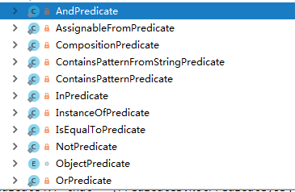

# Predicate

Predicate最基本的用法就是对Collection进行过滤。用做需要过滤的条件。

## 1. Predicate接口

定义一个条件，则需要实现一下Predicate接口的apply方法：

```java
package com.google.common.base;

import com.google.common.annotations.GwtCompatible;
import javax.annotation.Nullable;

@GwtCompatible
public interface Predicate<T> {
    boolean apply(@Nullable T var1);

    boolean equals(@Nullable Object var1);
}
```

Eg：

```java
.retryIfResult(new Predicate<QueryPayLoadData>() {
    @Override
    public boolean apply(@Nullable QueryPayLoadData queryPayLoadData) {
        if (queryPayLoadData.respCodeSuccess()) {
            log.debug("成功！");
            return false;
        }
        return true;
    }
})
```

## 2. Predicates实现条件组合

* and
* or 
* not
* equalTo
* instanceOf
* assignableFrom

Usage：

```java
Predicate<User> andPre= Predicates.and(predicate1, predicate2);
Predicate<User> orPre= Predicates.or(predicate1, predicate2);
Predicate<User> notPre= Predicates.not(predicate1);
List<User> filteredUsers = 

//filter并生成新的列表
Lists.newArrayList(Iterators.filter(users.iterator(), predicate1));
```

## 3. Predicates剖析

### 3.1 所有的static都实现了Predicate接口



OrPredicate:

```java
public boolean apply(@Nullable T t) {
    for(int i = 0; i < this.components.size(); ++i) {
       if (((Predicate)this.components.get(i)).apply(t)) {
            return true;
        }
    }
    return false;
}

public boolean equals(@Nullable Object obj) {
    if (obj instanceof Predicates.OrPredicate) {
        Predicates.OrPredicate<?> that = (Predicates.OrPredicate)obj;
        return this.components.equals(that.components);
    } else {
        return false;
    }
}
```

### 3.2 枚举实现接口

```java
static enum ObjectPredicate implements Predicate<Object> {
    ALWAYS_TRUE {
        public boolean apply(@Nullable Object o) {
            return true;
        }

        public String toString() {
            return "Predicates.alwaysTrue()";
        }
    },
    IS_NULL {
        public boolean apply(@Nullable Object o) {
            return o == null;
        }

        public String toString() {
            return "Predicates.isNull()";
        }
    }

    private ObjectPredicate() {
    }

    <T> Predicate<T> withNarrowedType() {
        return this;
    }
}
```

Usage:

```java
public static <T> Predicate<T> notNull() {
        return Predicates.ObjectPredicate.NOT_NULL.withNarrowedType();
    }
```

### 3.3 class测试

Class类的**isAssignableFrom\(Class cls\)**方法，如果调用这个方法的class或接口 与 参数cls表示的类或接口相同，或者是参数cls表示的类或接口的父类，则返回true。

Class类的**isInstance\(Object obj\)**方法，obj是被测试的对象，如果obj是调用这个方法的class或接口 的实例，则返回true。这个方法是instanceof运算符的动态等价。

### 3.4 compose

```java
<A, B> Predicate<A> compose(Predicate<B> predicate, Function<A, ? extends B> function)
```

将B类型的条件转为合并为A类型的条件，通过一个从B到A的Function来做转换。

