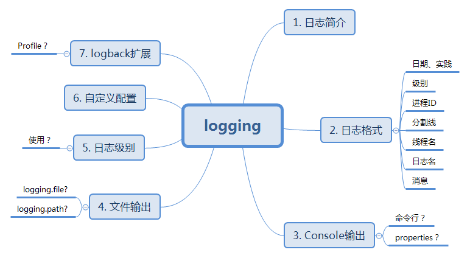

# Integration-Logback




## 1. 日志简介

\*\*\*\*[**Slf4j**](http://www.slf4j.org/)（Simple Logging Façade For Java），是一个简单日志门面抽象框架，它本身只提供了日志Facade API和一个简单的日志类实现，一般常配合**Log4j**，**LogBack**，**JdkLog**使用。

LogBack和Log4j都是开源日记工具库，LogBack是Log4j的改良版本，比Log4j拥有更多的特性，同时也带来很大性能提升。

spring-boot默认支持logback，所以无需引用任何以来只需要，配置application.properties即可。

* 默认Console就启用
* FileAppender而可选

### 1.1 日志格式

```text
2014-03-05 10:57:51.112  INFO 45469 --- [           main] org.apache.catalina.core.StandardEngine  : Starting Servlet Engine: Apache Tomcat/7.0.52
```

logback是没有FATAL的，映射到了ERROR。

### 1.2 Console Appender

#### How to 命令行指定debug？

默认情况下console的被输出， 命令行启动制定日志级别：

```bash
$ java -jar myapp.jar --debug
```

debug模式启用的时候，**a selection of core loggers** \(embedded container, Hibernate and Spring Boot\) are configured to output more information.

#### How to 配置文件指定debug？

```yaml
debug:
  true

# 并不是，这样不起作用
logging:
  level: debug
```

### 1.3. File Appender

默认情况下，Spring boot 只开启Console的日志，不开启File的日志。

如何开启文件日志？如下属性至少选一个。

```text
logging.file= #文件路径，可以是相对当前目录的路径或者绝对路径
logging.path= #默认文件是spring.log。文件目录，可以是相对当前的路径或者绝对路径
```

文件的大小为10M滚动。

### 1.4. 日志级别level

```text
ALL < DEBUG < INFO < WARN < ERROR <FATAL < OFF
```

配置格式：`logging.level.*=LEVEL`：

完整示例（通常就够用了）：

```yaml
logging:
  level:
    root: warn
    com.l3.java: info
    com.l3.spex: info
    com.l3.def: debug
    com.l3.cs: debug
  file:
    path: ./log/l3-api.log
```

## 2. Logger ctuator

结合actuator动态修改level，可以结合spring-boot-admin使用：

* 查看所有：GET http://localhost:8091/actuator/loggers
* 查看包：GET http://localhost:8091/actuator/loggers/com.l3.sigma
* 修改日志级别：POST http://localhost:8091/actuator/loggers/com.l3.sigma

  Request Body：

  ```javascript
  POST http://localhost:8091/actuator/loggers/com.l3.sigma

  {
    "configuredLevel":"DEBUG"
  }
  ```

## 3. 自定义日志扩展

### 3.1 自定义文件名

| 日志系统 | 可以自定义的地方 |
| :--- | :--- |
| Logback | **logback-spring.xml**, logback-spring.groovy, logback.xml or logback.groovy |
| Log4j2 | log4j2-spring.xml or log4j2.xml |
| JDK \(Java Util Logging\) | logging.properties |


强烈推荐使用X-spring.xml的配置文件，以更好地支持上下文。


### 3.2 自定义内容

* include：包含外部配置节`<included>`
* property：定义变量
* appender：各种数据源输出，Eg：File，Tcp，DB，Kafka，JSON，Console，ES等；
* layout：输出样式
* logger：可以不同logger不同level

### 3.3 通过profile来指定不一样的logger

不同的环境配置不同的日志：

```markup
<springProfile name="staging">
    <!-- configuration to be enabled when the "staging" profile is active -->
</springProfile>

<springProfile name="dev, staging">
    <!-- configuration to be enabled when the "dev" or "staging" profiles are active -->
  	<logger name="smoketest.logback" level="TRACE" />
</springProfile>

<springProfile name="!production">
    <!-- configuration to be enabled when the "production" profile is not active -->
</springProfile>
```


