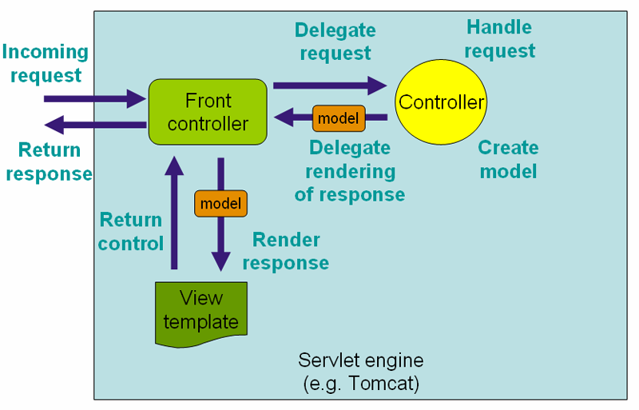

# Restful Api

## 1. Introduction

什么是[Restful](https://en.wikipedia.org/wiki/Representational_state_transfer) API？——只需关注快速标记

Spring Boot支持：

* 基于Java API for RESTful Web Services \(JAX-RS\) 1.1 \(JSR 311\)
* 基于Spring MVC

## 2.  Usage

* jar：spring-web
* package：`org.springframework.web.bind.annotation`

### 2.1 API层

<table>
  <thead>
    <tr>
      <th style="text-align:left">Annotation</th>
      <th style="text-align:left">Description</th>
    </tr>
  </thead>
  <tbody>
    <tr>
      <td style="text-align:left"><code>@RestController</code>
      </td>
      <td style="text-align:left">
        <ol>
          <li>@Controller @ResponseBody&#x7684;&#x5408;&#x4F53;&#xFF1B;</li>
          <li><pre><code class="lang-java">@Target({ElementType.TYPE})
@Retention(RetentionPolicy.RUNTIME)
@Documented
@Controller
@ResponseBody
public @interface RestController {
    @AliasFor(
        annotation = Controller.class
    )
    String value() default &quot;&quot;;
}</code></pre>

          </li>
        </ol>
      </td>
    </tr>
    <tr>
      <td style="text-align:left"><code>@RequestMapping</code>
      </td>
      <td style="text-align:left">&#x8BF7;&#x6C42;&#x8DEF;&#x7531;&#xFF0C;&#x53EF;&#x4EE5;&#x6307;&#x5B9A;HttpMethod</td>
    </tr>
    <tr>
      <td style="text-align:left"><code>@Get/Post/Put/Delete/PatchMapping</code>
      </td>
      <td style="text-align:left">&#x8BF7;&#x6C42;&#x8DEF;&#x7531;</td>
    </tr>
    <tr>
      <td style="text-align:left"></td>
      <td style="text-align:left"></td>
    </tr>
    <tr>
      <td style="text-align:left"><code>@RequestBody</code>
      </td>
      <td style="text-align:left">&#x7528;&#x4E8E;&#x8BF7;&#x6C42;&#x4F53;&#x53C2;&#x6570;</td>
    </tr>
    <tr>
      <td style="text-align:left"><code>@PathVariable</code>
      </td>
      <td style="text-align:left">&#x8DEF;&#x5F84;&#x53D8;&#x91CF;&#xFF0C;eg&#xFF1A; /api/user/{name}</td>
    </tr>
    <tr>
      <td style="text-align:left"><code>@RequestParam</code>
      </td>
      <td style="text-align:left">&#x67E5;&#x8BE2;&#x53C2;&#x6570;</td>
    </tr>
    <tr>
      <td style="text-align:left"><code>@RequestHeader</code>
      </td>
      <td style="text-align:left">HTTP Header&#x53C2;&#x6570;</td>
    </tr>
    <tr>
      <td style="text-align:left"><code>@RequestAttribute</code>
      </td>
      <td style="text-align:left"></td>
    </tr>
    <tr>
      <td style="text-align:left"><code>@CookieValue</code>
      </td>
      <td style="text-align:left"></td>
    </tr>
    <tr>
      <td style="text-align:left"><code>@RequestPart</code>
      </td>
      <td style="text-align:left">&#x6587;&#x4EF6;</td>
    </tr>
    <tr>
      <td style="text-align:left"><code>@ResponseBody</code>
      </td>
      <td style="text-align:left">&#x54CD;&#x5E94;JSON</td>
    </tr>
    <tr>
      <td style="text-align:left"><code>@ResponseStatus</code>
      </td>
      <td style="text-align:left">&#x54CD;&#x5E94;&#x72B6;&#x6001;</td>
    </tr>
    <tr>
      <td style="text-align:left"></td>
      <td style="text-align:left"></td>
    </tr>
    <tr>
      <td style="text-align:left"><code>@CrossOrigin</code>
      </td>
      <td style="text-align:left">&#x8DE8;&#x57DF;</td>
    </tr>
    <tr>
      <td style="text-align:left"></td>
      <td style="text-align:left"></td>
    </tr>
    <tr>
      <td style="text-align:left"><code>@ControllerAdvice</code>
      </td>
      <td style="text-align:left"></td>
    </tr>
    <tr>
      <td style="text-align:left"><code>@ExceptionHandler</code>
      </td>
      <td style="text-align:left">&#x5F02;&#x5E38;&#x5904;&#x7406;</td>
    </tr>
    <tr>
      <td style="text-align:left"></td>
      <td style="text-align:left"></td>
    </tr>
    <tr>
      <td style="text-align:left"><code>HttpServletRequest</code>
      </td>
      <td style="text-align:left">&#x8BF7;&#x6C42;</td>
    </tr>
    <tr>
      <td style="text-align:left"><code>HttpServletResponse</code>
      </td>
      <td style="text-align:left">&#x54CD;&#x5E94;</td>
    </tr>
  </tbody>
</table>

### 2.2 服务层

| Annotation | Description |
| :--- | :--- |
| `@Service` | 服务层 |
| `@Component` | 组件层、服务层 |
| `@Repository` | 仓储层 |
|  |  |

### 2.3 配置层

| Annotation | Description |
| :--- | :--- |
| `@Configuration` |  |
| `@Bean` | 手动注入Bean |
| `@ConfigurationProperties` | 配置文件 |
|  |  |

