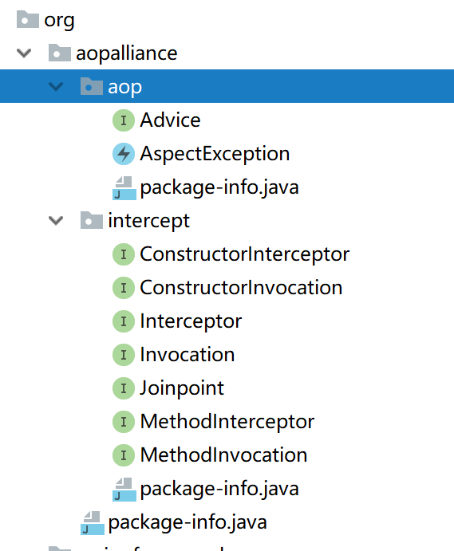

# aopalliance结构

## 1. 包

```java
package org.aopalliance;
```



## 2. 详细

* aop.Advice：标记接口，所有拦截的根接口。
* aop.AspectException：异常。

intercept：

* Interceptor：通用的拦截器标记。
* Joinpoint：通用的运行时连接点。

  程序执行的某个特定位置（如：某个方法调用前、调用后，方法抛出异常后）。

  一个类或一段程序代码拥有一些具有边界性质的特定点，这些代码中的特定点就是连接点。

  Spring仅支持方法的连接点。

  * proceed

* Invocation：代表一个Invocation。
  * getArguments
* MethodInvocation：基于方法调用的Invocation
  * getMethod
* ConstructorInvocation：构造调研
  * getConstructor
* **MethodInterceptor**：方法拦截器
  * Object invoke\(MethodInvocation invocation\)
* ConstructorInterceptor: 构造拦截器
  * Object construct\(ConstructorInvocation invocation\)

