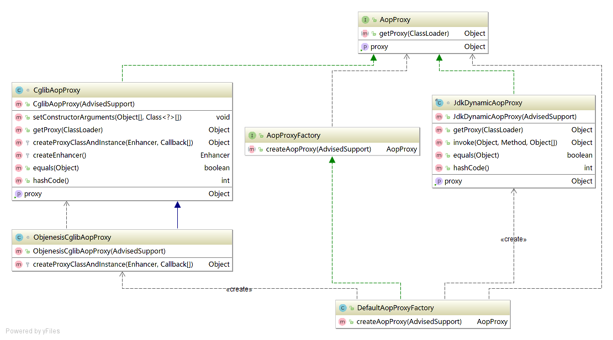

# AopProxy分析

AOP代理的层次结构：

从上图中可以看出：

* AopProxy：定义了代理的接口
* AopProxyFactoy：定义了工厂接口，为了创建AopProxy；
* DefaultAopProxyFactory：则是AopProxyFactoy的实现
* CglibAopProxy：一种实现
* JdkDynamicAopProxy：另一种实现

典型的工厂模式。

## JdkDynamicAopProxy.getProxy

1. 得到proxiedInterfaces
2. Proxy.newProxyInstance

JdkDynamicAopProxy为什么实现了InvocationHandler？

因为：newProxyInstance\(ClassLoader loader, Class&lt;?&gt;\[\] interfaces, InvocationHandler h\) 最后一个参数为InvocationHandler。这是一种设计技巧。

## CglibAopProxy.getProxy

1. 构造enhancer
2. enhancer.create

