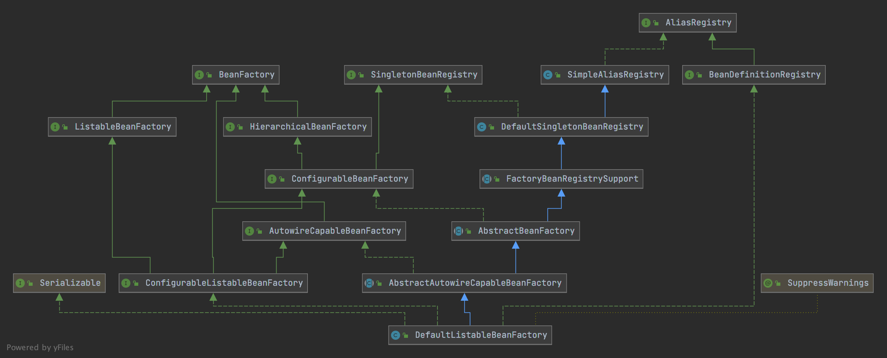

# 容器的存储——BeanFactory体系

## 1. Introduction



ApplicationContext内部由`DefaultListableBeanFactory`存储Bean信息。

从两个角度去看：

* 接口的继承层次，按照不同功能划分；
  * 层级
  * 列表
  * 配置
  * 自动装配
* `DefaultListableBeanFactory`的具体实现
  * 存储
  * 单例处理
  * getBean核心逻辑

## 2. bean存储

```java
/** Map of bean definition objects, keyed by bean name. */
private final Map<String, BeanDefinition> beanDefinitionMap = 
	new ConcurrentHashMap<>(256);
	
/** List of bean definition names, in registration order. */
private volatile List<String> beanDefinitionNames = new ArrayList<>(256);
```


